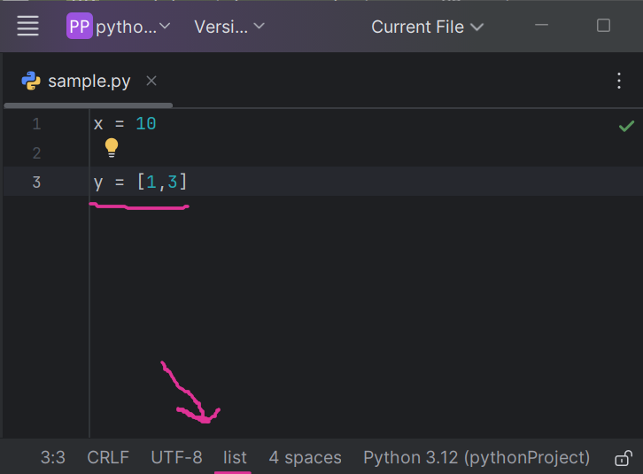

## Caret Type Inference Plugin

### Overview
The **Caret Type Inference Plugin** is a PyCharm plugin designed to provide developers with real-time type information for variables under the caret in Python files. When the caret is positioned over a variable, the plugin displays the inferred type of that variable in the status bar. This enhances the developer experience by providing useful insights about variable types without needing to manually check or run the code.

### Features
- **Type Inference:** Automatically infers and displays the type of the variable under the caret.
- **Status Bar Display:** The variable type is shown in the status bar, making it easily accessible while editing the code.
- **Supports Python Files:** Specifically designed for Python code in PyCharm.

### Installation

1. Clone the repository to your local machine:
   ```bash
   git clone https://github.com/azimsh3r/caret-typeinference-plugin.git
   ```
   
2. Open the project in IntelliJ IDEA or PyCharm.

3. Build and run the plugin in the IDE by following the [IntelliJ Plugin Development Documentation](https://plugins.jetbrains.com/docs/intellij/writing-your-first-plugin.html).

4. Once the plugin is installed, it will automatically display the type of the variable under the caret in the status bar.

### How It Works

The plugin listens for changes in the caret position within the editor. When the caret moves, the plugin:
1. Retrieves the variable under the caret.
2. Analyzes the variable’s type using PyCharm's `TypeEvalContext`.
3. Displays the inferred type in the status bar.



The plugin works by using PyCharm's PSI (Program Structure Interface) and PSI tree utilities to analyze the code's structure and determine the type of the variable at the caret's current position.

### Key Classes and Components

- **`CaretListener`**: Listens for caret position changes and triggers type inference.
- **`PsiDocumentManager`**: Manages the relationship between documents and PSI files.
- **`TypeEvalContext`**: Used to infer the type of Python variables.

### Example

If you have the following Python code:
```python
x = 10
y = "Hello"
```

When the caret is on the variable `x`, the plugin will display `int` in the status bar. Similarly, when the caret is on `y`, the status bar will display `str`.
